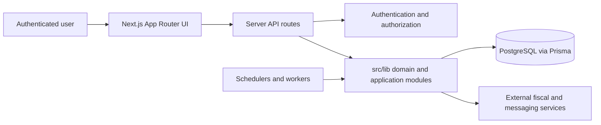

# QLMED architecture overview

QLMED is a Next.js application for receiving, organizing and operating on
Brazilian fiscal documents. It uses the App Router for UI and server routes,
PostgreSQL through Prisma for durable state, and background/integration modules
for SEFAZ, NSDocs, Receita NFS-e, OneDrive and notifications.

## Runtime boundaries

## Code boundaries

- `src/app/`: pages, layouts and HTTP route adapters.
- `src/lib/`: application, domain and integration behavior shared by routes.
- `src/lib/schemas/`: validation at external boundaries.
- `src/lib/sync-strategies/`: integration-specific synchronization strategies.
- `src/components/`: reusable UI components.
- `prisma/`: canonical database schema and migration history.
- `scripts/`: operational verification and controlled maintenance commands.

Routes should authenticate, validate and delegate. Reusable business or
integration behavior belongs in `src/lib`, not duplicated across route files.

## Persistence boundary

The persistent QLMED runtime has one canonical PostgreSQL database. Every
application process receives its connection through the single protected
`DATABASE_URL` variable; the application rejects `qlmed_dev` and parallel URL
aliases so that environments cannot silently drift to different schemas. In
the production Compose contract the database name is `postgres`.

CI creates a disposable `qlmed_ci` PostgreSQL service for migration replay and
tests. It is not a second persistent QLMED environment and is destroyed with
the job. Local work must disable background services and must not run deploy or
production migration commands as part of ordinary verification.

The `server-backup` project owns the recovery contract for the canonical
database through its `qlmed` backup set. A recent backup receipt is a
precondition for data-changing maintenance; the application never reads backup
files or backup credentials itself.

Production deployment remains driven by the GitHub Actions workflow after CI
succeeds on `main`.
