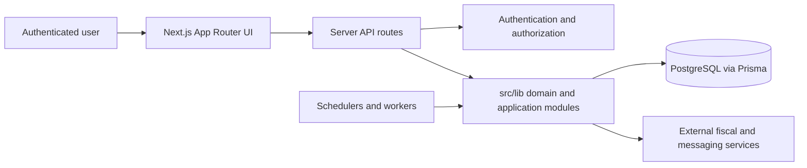

# QLMED architecture overview

QLMED is a Next.js application for receiving, organizing and operating on
Brazilian fiscal documents. It uses the App Router for UI and server routes,
PostgreSQL through Prisma for durable state, and background/integration modules
for SEFAZ, NSDocs, Receita NFS-e, OneDrive and notifications.

## Runtime boundaries

## Code boundaries

- `src/app/`: pages, layouts and HTTP route adapters.
- `src/lib/`: application, domain and integration behavior shared by routes.
- `src/lib/schemas/`: validation at external boundaries.
- `src/lib/sync-strategies/`: integration-specific synchronization strategies.
- `src/components/`: reusable UI components.
- `prisma/`: canonical database schema and migration history.
- `scripts/`: operational verification and controlled maintenance commands.

Routes should authenticate, validate and delegate. Reusable business or
integration behavior belongs in `src/lib`, not duplicated across route files.

## Persistence boundary

QLMED has one persistent canonical PostgreSQL database (`postgres`) through
`DATABASE_URL`, plus disposable CI `qlmed_ci`. See
[ADR-0020](../decisions/0020-omarchy-next-canonical-writer-tunnel.md).

Production publication is local. `npm run verify:release <SHA>` runs inside
the isolated container and writes a receipt. `npm run deploy:local -- DEPLOY
<SHA> --publish` updates vps2. `git push origin main` is backup only. See
[ADR-0021](../decisions/0021-verificacao-e-deploy-locais.md).
